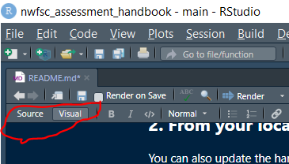

# nwfsc_assessment_handbook

This document was converted from [this google doc](https://docs.google.com/document/d/1vYDYWFMb_WlsjlrY1P_muwaKJmn5e-421K-FKXTk-Nw/).

This handbook is a living document. Please update it with your hard-won knowledge and experience so that others can benefit! There are several options for editing:

## 1. Quick and dirty

If you are making minor text-only changes to a single section of the handbook (i.e., one .qmd document), you are welcome to make changes directly from the GitHub web interface. No particular knowledge of markdown or quarto is required for text-only changes:

Once your edits are committed, GitHub will automatically render and publish the new html files. You can check the status of this update (and make sure there was not an error) through the actions tab of the GitHub repository:

## 2. From your local computer

You can also update the handbook the way you would normally make changes to a git repository, by [cloning it to your local machine](https://docs.github.com/en/repositories/creating-and-managing-repositories/cloning-a-repository), making changes, [committing them](https://docs.github.com/en/get-started/using-git/about-git#basic-git-commands), and [pushing them back to the remote repository](https://docs.github.com/en/get-started/using-git/pushing-commits-to-a-remote-repository). This is especially useful for more significant changes where you want to make sure the document will still render, or changes to multiple sections of the handbook at once. The directions below assume you know the [basics of using git and GitHub](https://docs.github.com/en/get-started/onboarding/getting-started-with-your-github-account), and are specific to rendering a quarto book. You can find more information on quarto books [here](https://quarto.org/docs/books/).

Before editing the files, you will need to [install quarto](https://quarto.org/docs/get-started/). You do not need IT to do this. Now, you can make changes. You can now use any text editor of your choosing. Below are directions for RStudio and Visual Studio Code.

### RStudio

Once you have cloned the repository to your local machine, open "nwfsc_assessment_handbook.Rproj" in RStudio. **It is important that you open the R project first and not an individual .qmd file.** A new instance of RStudio should open. *Now* you can open the .qmd file(s) for whichever section(s) of the handbook you wish to edit, and make any changes.

While you are editing, feel free to flip between the "source" mode which is text only and includes the markdown-like markup, and th "visual" mode, which feels more like using a word processor:

Once you are done making your changes (or partway through to check things out), click on render to see what the formatted html site will look like:

Rinse and repeat. See the overview the folks from quarto wrote [here](https://quarto.org/docs/tools/rstudio.html).

### Visual Studio Code

You will need to install the [quarto VS Code extention](https://marketplace.visualstudio.com/items?itemName=quarto.quarto). Open the .qmd file(s) that you want to edit and make any changes. Once you are done making your changes (or partway through to check things out), click on render to see what the formatted html site will look like:

Rinse and repeat. See the overview the folks from quarto wrote [here](https://quarto.org/docs/tools/vscode.html).

### When you are done

Commit and push your changes to the remote repository. GitHub actions will re-render the whole shebang and update the webpage where the handbook is hosted. You can check to make sure this process did not result in an error via the directions under [Quick and dirty].
